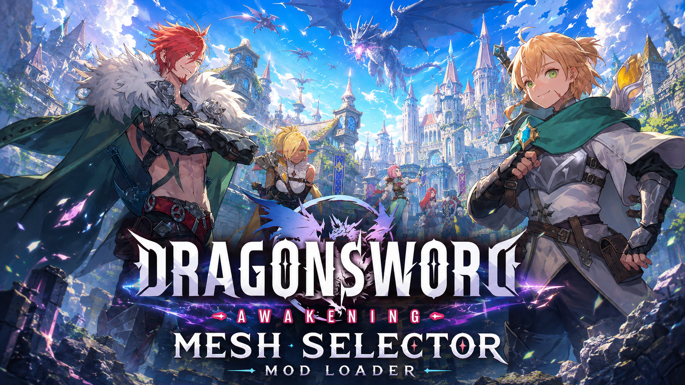

# DragonSword Mesh Selector — Mod Loader
The guide is split into focused chapters so you can make mods and add them in DragonSword Awakening and switch in the fly.

| Chapter | Description |
|---|---|
| [00 — Changelog](https://github.com/Hoverbike51/DSMS-ModLoader/tree/main/Documentation/00-Changelog.md) | All Changelog |
| [01 — Overview](https://github.com/Hoverbike51/DSMS-ModLoader/tree/main/Documentation/01-Overview.md) | What the ModLoader does and how profiles are discovered. |
| [02 — Mod Loader Installation](https://github.com/Hoverbike51/DSMS-ModLoader/tree/main/Documentation/02-ModLoader-Installation.md) | Install UE4SS, LogicMod and Lua scripts. |
| [03 — Installing Presets](https://github.com/Hoverbike51/DSMS-ModLoader/tree/main/Documentation/03-Installing-presets.md) | Install and rescan selector presets. |
| [04 — Creating JSON v3 Presets](https://github.com/Hoverbike51/DSMS-ModLoader/tree/main/Documentation/04-Creating-JSON-presets.md) | Schema-v3 example and complete field reference. |
| [05 — Creating Advanced JSON v3](https://github.com/Hoverbike51/DSMS-ModLoader/tree/main/Documentation/05-Creating-Advanced-JSON-presets.m) | Schema-v3 advanced |
| [06 — Troubleshooting](https://github.com/Hoverbike51/DSMS-ModLoader/tree/main/Documentation/06-Troubleshooting.md) | Troubleshooting and Possible fix |
| [EXTRA — Unreal Engine Route](https://github.com/Hoverbike51/DSMS-ModLoader/blob/main/Documentation/EXTRA/Unreal-Route-Full.md) | DragonSword Awakening Unreal 5.3 PAK Route |

---
>[!IMPORTANT]
> Download the JSON presets needed for DSMS-Mod Loader [Here](Presets/DSMS_Official_Presets_v0.7.1.zip) (latest).\
>\
>[v0.7.0](Presets/DSMS_Official_Presets_v0.7.0.zip)
>
---

## Quick controls

- **F5** — Open or close the selector after a playable world is loaded.
- **F6** — Rescan the JSON preset library.

---
## Others Tools
[DSMS Preset Studio](https://github.com/Hoverbike51/DSMS-Preset-Studio) is a Windows desktop application for creating, reviewing and validating DragonSword: Awakening presets for DSMS ModLoader.

---
